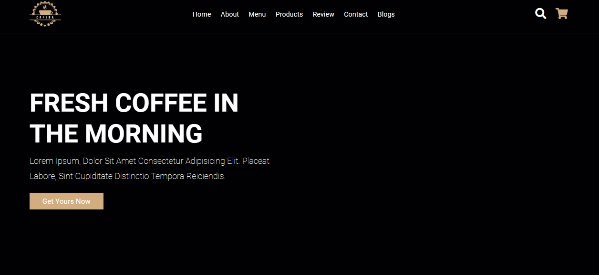

<p align="center">
   
</p>

<p align="right">
   
</p>


<h1 align="center"></h1>

<p align="center">
  

  

  

    

    

    
</p>


<p align="center">
  <a href="#dart-about">About</a> &#xa0; | &#xa0; 
  <a href="#sparkles-features">Features</a> &#xa0; | &#xa0;
  <a href="#rocket-technologies">Technologies</a> &#xa0; | &#xa0;
  <a href="#white_check_mark-requirements">Requirements</a> &#xa0; | &#xa0;
  <a href="#checkered_flag-starting">Starting</a> &#xa0; | &#xa0;
  <a href="#memo-license">License</a> &#xa0; | &#xa0;
  <a href="https://github.com/agostinhomarcia" target="_blank">Author</a>&#xa0; | &#xa0
  <a href="#" target="_blank" rel="noopener noreferrer">Projeto</a>
</p>

<br>

## :dart: About ##


<h4 align="center"> Coffe</h4>

<p align="center">
 
</p>


## :sparkles: Features ##

:heavy_check_mark: Add Product Cart;\
:heavy_check_mark: Feature 2;\
:heavy_check_mark: Feature 3;

## :rocket: Technologies ##

The following tools were used in this project:


- [JavaScript](https://developer.mozilla.org/pt-BR/docs/Web/JavaScript) 
- [Html](https://developer.mozilla.org/pt-BR/docs/Web/HTML/Element/html/)  
- [CSS](https://developer.mozilla.org/pt-BR/docs/Web/CSS)  


## :white_check_mark: Requirements ##

Before starting :checkered_flag:, you need to have [Git](https://git-scm.com) and [Node](https://nodejs.org/en/) installed.

## :checkered_flag: Starting ##


```bash
# Clone this project
$ git clone https://github.com/agostinhomarcia/projeto-cart-cafe.git
# Access
$ cd projeto-cart-cafe
# The server will initialize in the <http://127.0.0.1:5500/index.html>
```


## :memo: License ##


This project is under the [MIT license](./License).

Made with love by [Márcia Agostinho](https://github.com/agostinhomarcia) 🚀.


<p align="center">
   
</p>

&#xa0;

<a href="#top">Back to top </a>